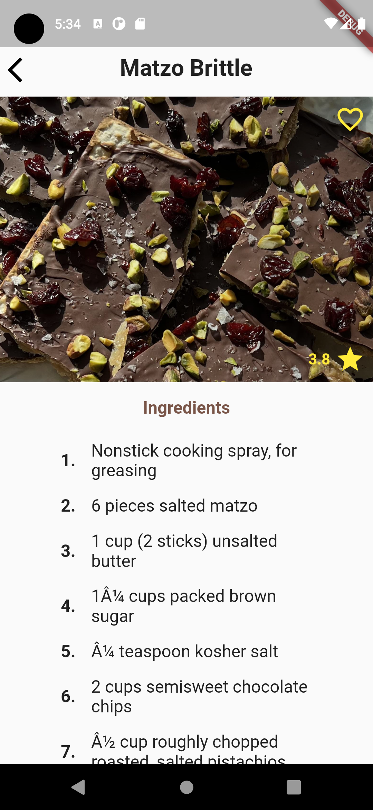
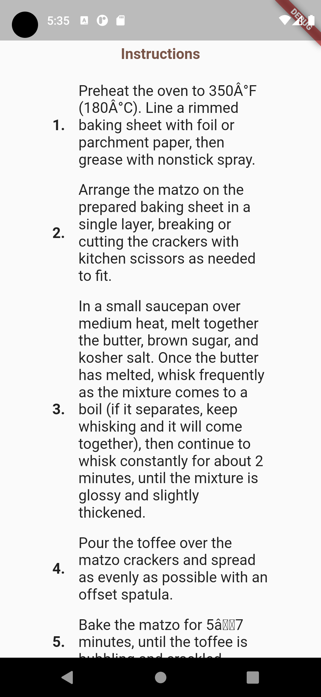

# Flutter Recipes App 🍳

Flutter Recipes App is a mobile application built with Flutter that displays various recipes in different categories. The app provides a user-friendly interface that allows users to browse through different recipes, view ingredients and instructions, and save their favorite recipes for future use.

## Features

- Browse different recipes
- View recipe details including ingredients and instructions
- Search for recipes by name
- Save favorite recipes for future reference

## App UI

<div style='display: flex'>




</div>

## Getting Started

To get started with Flutter Recipes App, follow these steps:

1. Clone the repository:

```bash
git clone https://github.com/MohammadRRamis/Flutter-Recipes-App.git
```

2. Install dependencies:

```dart
flutter pub get
```

3. Run the app:

```dart
flutter run
```

## Contributing

Contributions are welcome! If you find any bugs or have suggestions for new features, please create an issue on the GitHub repository or submit a pull request.

## Credits

Flutter Recipes App was developed by Mohammad Al Ramis.
